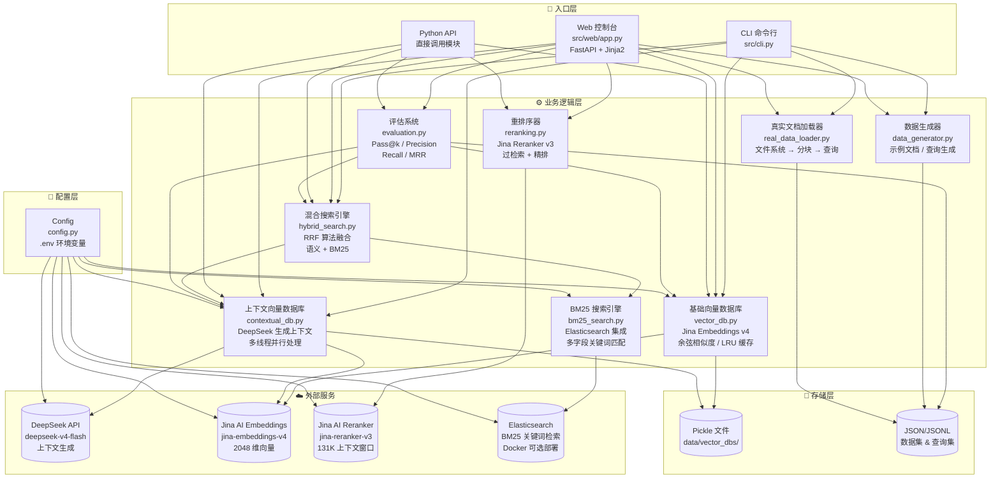
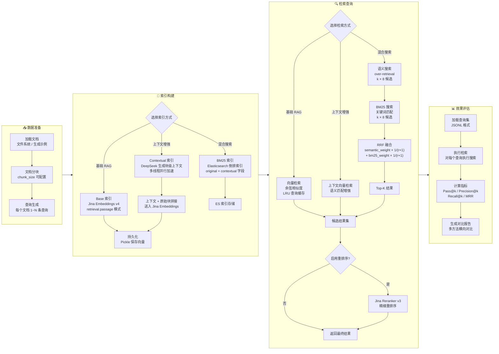
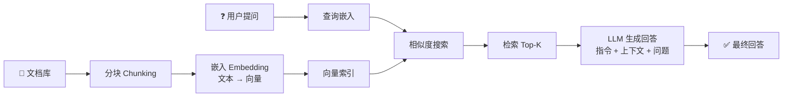

# 上下文检索系统

一个生产级的检索增强生成（RAG）系统，实现从基础向量搜索到高级混合检索的完整技术栈。

## 功能特性

### 核心功能

- **基础向量搜索**: 使用 Jina AI Embeddings v4 生成高质量嵌入（2048维），余弦相似度搜索
- **上下文增强**: 使用 DeepSeek V4 Flash 生成块级上下文描述，提升检索精度
- **BM25 搜索**: Elasticsearch 集成，支持多字段关键词搜索
- **混合搜索引擎**: 结合语义搜索和 BM25，使用 RRF 算法合并结果
- **Jina AI 重排序**: 使用 Jina Reranker v3 精细化结果排序，131K 上下文窗口
- **完整评估系统**: 支持 Pass@k、Precision@k、Recall@k、MRR 等指标
- **真实文档评估**: 从文件系统加载文档，自动分块、生成查询并评测
- **Web 控制台**: FastAPI 本地 Web 界面，零依赖浏览器操作全流程

### 技术亮点

- 极低成本：DeepSeek V4 Flash $0.14/M tokens 输入，Jina AI 提供免费额度
- 并行处理：多线程加速上下文生成
- LRU 查询缓存：避免重复嵌入计算
- 持久化存储：pickle 格式保存向量数据库
- 灵活配置：环境变量 + .env 文件
- 完善的错误处理：指数退避重试机制

## 性能指标

基于原始 Anthropic Cookbook 的实验结果：

| 方法 | Pass@5 | Pass@10 | Pass@20 | 成本 |
|------|--------|---------|---------|------|
| 基础 RAG | 80.92% | 87.15% | 90.06% | 低 |
| + 上下文嵌入 | 88.12% | 92.34% | 94.29% | 中（一次性） |
| + 混合搜索 | 88.86% | 93.21% | 95.23% | 中（基础设施） |
| + 重排序 | 92.15% | 95.26% | 97.45% | 高（每次查询） |

## 安装

### 系统要求

- Python 3.8+
- Docker（可选，仅 BM25 搜索需要）

### 安装步骤

```bash
# 克隆项目
cd D:\contextual-retrieval

# 创建虚拟环境
python -m venv venv
source venv/bin/activate  # Windows: venv\Scripts\activate

# 安装依赖
pip install -r requirements.txt

# 配置环境变量
cp .env.example .env
# 编辑 .env 文件，填入 API keys

# （可选）启动 Elasticsearch
docker run -d --name elasticsearch -p 9200:9200 \
  -e "discovery.type=single-node" \
  -e "xpack.security.enabled=false" \
  elasticsearch:9.2.0
```

### 环境变量

在 `.env` 文件中配置以下变量：

```bash
# API 密钥（必需）
DEEPSEEK_API_KEY=sk-your_deepseek_api_key    # https://platform.deepseek.com
JINA_API_KEY=jina_your_jina_api_key          # https://jina.ai (免费额度)

# 向后兼容（可选，设置上面新变量后可忽略）
ANTHROPIC_API_KEY=sk-your_deepseek_api_key   # → 等同于 DEEPSEEK_API_KEY
VOYAGE_API_KEY=jina_your_jina_api_key        # → 等同于 JINA_API_KEY
COHERE_API_KEY=jina_your_jina_api_key        # → 等同于 JINA_API_KEY

# Elasticsearch（可选）
ELASTICSEARCH_URL=http://localhost:9200
```

### 获取 API 密钥

| 服务 | 用途 | 注册地址 | 费用 |
|------|------|----------|------|
| **DeepSeek** | 上下文生成 | [platform.deepseek.com](https://platform.deepseek.com) | 按量付费，极低价格 |
| **Jina AI** | 嵌入 + 重排序 | [jina.ai](https://jina.ai) | 免费额度 100万 tokens/天 |

## 快速开始

### 1. 生成示例数据

```bash
python -m src.cli generate-data \
  --num-docs 10 \
  --chunks-per-doc 5 \
  --num-queries 20
```

### 2. 创建索引

```bash
# 基础向量数据库
python -m src.cli index \
  --method base \
  --name base_db

# 上下文向量数据库
python -m src.cli index \
  --method contextual \
  --name contextual_db \
  --parallel-threads 5
```

### 3. 执行搜索

```bash
# 基础搜索
python -m src.cli search \
  "How to implement authentication?" \
  --name base_db \
  --method base \
  --k 10

# 上下文搜索
python -m src.cli search \
  "How to implement authentication?" \
  --name contextual_db \
  --method contextual \
  --k 10
```

### 4. 混合搜索

```bash
python -m src.cli hybrid-search \
  "How to implement authentication?" \
  --name contextual_db \
  --k 10 \
  --semantic-weight 0.8 \
  --bm25-weight 0.2
```

### 5. 评估性能

```bash
# 评估现有索引
python -m src.cli evaluate \
  --name contextual_db \
  --method contextual \
  --queries data/sample_queries.jsonl \
  --k-values 5 10 20

# 从真实文档一键评估（加载→分块→生成查询→建索引→评测）
python -m src.cli evaluate-real \
  --data-dir "./my_docs" \
  --name my_eval \
  --queries-per-doc 3 \
  --k-values 5 10 20

# 同时评估混合搜索（+BM25），需先启动 Elasticsearch
python -m src.cli evaluate-real \
  --data-dir "./my_docs" \
  --name my_eval \
  --hybrid \
  --semantic-weight 0.8 \
  --bm25-weight 0.2

# 包含 AGENTS.md 等默认排除的文件
python -m src.cli evaluate-real \
  --data-dir "./my_docs" \
  --include-agents
```

### 6. Web 控制台

启动本地 Web 界面，在浏览器中完成数据准备、索引构建、搜索和评估全流程：

```bash
python -m src.web.app
```

浏览器打开 http://127.0.0.1:8000，左侧导航栏提供五个面板：

| 面板 | 功能 |
|------|------|
| 配置检查 | 自动检测 DeepSeek/Jina/Elasticsearch 连接状态 |
| 数据准备 | 生成示例数据或处理真实文档目录 |
| 索引构建 | 创建 base/contextual 向量索引并查看 token 统计 |
| 检索重排 | base/contextual/hybrid 三种搜索 + Jina 重排序 |
| 效果评估 | Pass@k / Precision / Recall / MRR 指标表格 |

> Web 控制台是本地单机工具，密钥只读，索引沿用 `data/vector_dbs`，无需额外配置。

## Python API 使用

### 基础向量搜索

```python
from src.config import Config
from src.vector_db import VectorDBImpl
from src.data_generator import DataGenerator

# 加载配置
config = Config.from_env()
config.validate()

# 加载数据
generator = DataGenerator(config)
dataset = generator.load_dataset("data/sample_dataset.json")

# 创建向量数据库
db = VectorDBImpl("my_db", config)
db.load_data(dataset)

# 执行搜索
results = db.search("查询文本", k=10)

for result in results:
    print(f"相似度: {result['similarity']:.4f}")
    print(f"内容: {result['metadata']['content'][:100]}...")
```

### 上下文增强搜索

```python
from src.contextual_db import ContextualVectorDB

# 创建上下文向量数据库
db = ContextualVectorDB("my_contextual_db", config)
db.load_data(dataset, parallel_threads=5)

# 查看 token 统计
stats = db.get_token_stats()
print(f"输入 tokens: {stats['input_tokens']:,}")
print(f"输出 tokens: {stats['output_tokens']:,}")

# 执行搜索
results = db.search("查询文本", k=10)
```

### 混合搜索

```python
from src.hybrid_search import HybridSearchEngine
from src.bm25_search import ElasticsearchBM25

# 创建 BM25 索引
bm25_engine = ElasticsearchBM25("my_index", config)
bm25_engine.index_documents(db.metadata)

# 创建混合搜索引擎
engine = HybridSearchEngine(
    vector_db=db,
    bm25_engine=bm25_engine,
    semantic_weight=0.8,
    bm25_weight=0.2,
)

# 执行混合搜索
results = engine.search("查询文本", k=10)

# 查看来源分析
analysis = engine.get_source_analysis()
print(f"语义占比: {analysis['semantic_percentage']:.1f}%")
print(f"BM25 占比: {analysis['bm25_percentage']:.1f}%")
```

### 重排序

```python
from src.reranking import JinaReranker

# 创建重排序器
reranker = JinaReranker()

# 过检索 + 重排序
results = reranker.rerank_with_over_retrieval(
    query="查询文本",
    vector_db=db,
    k=10,
    recall_multiplier=10,
)

for result in results:
    print(f"重排序分数: {result['rerank_score']:.4f}")
```

> **向后兼容**: 也可使用 `CohereReranker` 别名，指向相同的 `JinaReranker` 实现。

### 性能评估

```python
from src.evaluation import Evaluator

# 创建评估器
evaluator = Evaluator(config)

# 加载查询集
queries = evaluator.load_queries("data/sample_queries.jsonl")

# 定义检索函数
def retrieve_func(query, k):
    return db.search(query, k=k)

# 执行评估
results = evaluator.evaluate(
    queries=queries,
    retrieval_function=retrieve_func,
    k_values=[5, 10, 20],
    method_name="上下文增强",
)

# 生成报告
report = evaluator.generate_report(results, "上下文增强")
print(report)
```

## 项目结构

```
contextual-retrieval/
├── src/                    # 源代码
│   ├── __init__.py
│   ├── config.py          # 配置管理
│   ├── utils.py           # 工具函数
│   ├── vector_db.py       # 基础向量数据库 (Jina Embeddings)
│   ├── contextual_db.py   # 上下文向量数据库 (DeepSeek)
│   ├── bm25_search.py     # BM25 搜索 (Elasticsearch)
│   ├── hybrid_search.py   # 混合搜索引擎 (RRF)
│   ├── reranking.py       # Jina AI 重排序器
│   ├── evaluation.py      # 评估系统
│   ├── data_generator.py  # 数据生成器
│   ├── real_data_loader.py # 真实文档加载器（分块、查询生成）
│   ├── cli.py             # 命令行接口
│   └── web/               # Web 控制台
│       ├── app.py         # FastAPI 应用与路由
│       ├── services.py    # 业务逻辑层
│       ├── schemas.py     # 数据模型
│       ├── templates/     # Jinja2 模板（7 个）
│       └── static/        # CSS + JS
├── tests/                 # 测试套件
├── examples/              # 使用示例
├── data/                  # 数据目录
├── docs/                  # 文档
├── requirements.txt       # Python 依赖
├── .env.example          # 环境变量模板
├── setup.py              # 安装脚本
└── README.md             # 项目文档
```

## 系统架构

### 系统结构图



### 业务流程图



> **图例说明**：系统结构图展示模块间的静态依赖关系，业务流程图展示从数据准备到评估的完整端到端流程。

## 技术原理

### 向量存储机制

**本项目未使用传统专用向量数据库（如 Pinecone、Weaviate、Chroma、Milvus 等）。**

向量存储和检索完全自主实现于 `src/vector_db.py`，采用 **Pickle 序列化 + 全量内存暴力检索**方案：

| 组件 | 实现方式 |
|------|----------|
| **存储格式** | `data/vector_dbs/<name>/vector_db.pkl` |
| **向量数据** | `List[np.ndarray]` — numpy 2048 维浮点数组列表 |
| **元数据** | `List[Dict]` — 文档 ID、块 ID、原文、上下文 |
| **缓存** | LRU 字典（上限 1000 条），避免重复嵌入计算 |
| **检索算法** | 全量余弦相似度：`np.dot(embeddings, query_embedding)` → `np.argsort` |
| **数据持久化** | pickle.dump → pickle.load |

> 适用场景：**小规模 Demo / 学术评估**（~数千个块）。无 ANN 索引（HNSW/IVF）、无分片、无分布式能力。选择此方案因为项目核心目标是**对比不同检索策略的精度差异**（base vs contextual vs hybrid vs rerank），而非构建高性能生产级检索系统。

### RAG 原理速览

RAG（检索增强生成）解决 LLM 的两大天然缺陷——**知识截止**和**幻觉**——通过在回答时实时检索外部知识库，约束模型基于真实上下文生成回答：



RAG 相比"全量上下文"的优势：每次只检索最相关的 5–20 块，**用更少 token 获得更高精度**，避免超长上下文中段的注意力衰减（"lost in the middle"）。

### 本项目 RAG 演进路线

```
基础 RAG          标准嵌入 + 余弦相似度
    ↓
上下文增强 RAG    块嵌入前注入 DeepSeek 全局语境
    ↓
混合搜索 RAG      语义 + BM25 关键词互补 (RRF 融合)
    ↓
重排序 RAG        过检索后 Jina Reranker 二次精排
```

每个阶段在精度和成本之间取不同权衡点，用户按场景选择：

| 阶段 | 精度提升 | 增量成本 | 推荐场景 |
|------|----------|----------|----------|
| 基础 RAG | 基准线 | 无 | 快速验证 |
| + 上下文增强 | +7–9% Pass@k | DeepSeek 一次性生成 | 低成本提精 |
| + 混合搜索 | +1–2% Pass@k | Elasticsearch 基础设施 | 平衡生产系统 |
| + 重排序 | +3–4% Pass@k | 每次查询 Jina 费用 | 最高精度需求 |

### 核心技术：上下文增强

传统 RAG 把文档切块后直接嵌入，检索时只匹配块内局部语义，**丢失全局语境**。例如一个块内容为 `"def __init__(self, api_key)"`，搜索"如何配置 API 密钥"可能匹配不上。

本项目对每个文档块，用 DeepSeek 生成块级上下文描述，与原始块内容拼接后再送入嵌入模型，使向量同时捕获局部语义和全局语境：

```
文档全文 + 当前块 ──→ DeepSeek ──→ "This chunk defines the constructor..."
                                      ↓
                   原始块内容 + 上下文描述 ──→ Jina Embeddings ──→ 2048维向量
```

### 核心技术：混合搜索与 RRF

混合搜索使用 RRF（Reciprocal Rank Fusion）算法，融合语义搜索（余弦相似度）和 BM25 关键词搜索的结果：

```python
score = semantic_weight × (1 / (rank_semantic + 1)) +
        bm25_weight × (1 / (rank_bm25 + 1))
```

默认权重 0.8:0.2，语义搜索主导、BM25 补充精确关键词匹配。同时使用 **过检索策略**（检索 k×8 个候选），确保融合后的候选池覆盖足够全面的结果。

## 技术细节

### 上下文生成

上下文生成使用 DeepSeek API（OpenAI 兼容协议），将整篇文档和当前块拼接后发送给模型，由模型生成简洁的块级上下文描述：

```python
response = self.llm_client.chat.completions.create(
    model=self.config.DEEPSEEK_MODEL,     # deepseek-v4-flash
    max_tokens=1000,
    temperature=0.0,
    messages=[{"role": "user", "content": prompt}],
)
```

生成的上下文与原始块内容拼接后再送入嵌入模型，使向量同时捕获局部语义和全局语境。

### RRF 算法

混合搜索使用 Reciprocal Rank Fusion 算法合并语义搜索和 BM25 的结果：

```python
score = semantic_weight * (1 / (rank_semantic + 1)) +
        bm25_weight * (1 / (rank_bm25 + 1))
```

### 并行处理

上下文生成使用多线程并行处理，可配置线程数以平衡速度与 API 速率限制：

```python
with ThreadPoolExecutor(max_workers=parallel_threads) as executor:
    futures = [
        executor.submit(process_chunk, doc, chunk)
        for doc in dataset
        for chunk in doc["chunks"]
    ]

    for future in as_completed(futures):
        result = future.result()
```

### Jina Embeddings 任务模式

Jina Embeddings v4 支持任务感知嵌入，系统自动区分：

- `retrieval.passage` — 文档/块嵌入（建库时）
- `retrieval.query` — 查询嵌入（搜索时）

这种非对称嵌入策略显著提升检索质量。

## 依赖服务

### API 服务

| 服务 | 模型 | 用途 | 注册 |
|------|------|------|------|
| **DeepSeek** | `deepseek-v4-flash` | 上下文描述生成 | [platform.deepseek.com](https://platform.deepseek.com) |
| **Jina AI** | `jina-embeddings-v4` | 向量嵌入（2048维） | [jina.ai](https://jina.ai) |
| **Jina AI** | `jina-reranker-v3` | 搜索结果重排序 | [jina.ai](https://jina.ai) |

### 基础设施

- **Elasticsearch**: 可选，用于 BM25 关键词搜索

启动 Elasticsearch：

```bash
docker run -d --name elasticsearch \
  -p 9200:9200 \
  -e "discovery.type=single-node" \
  -e "xpack.security.enabled=false" \
  elasticsearch:9.2.0
```

## 模型配置

可通过环境变量自定义模型：

```bash
# 模型配置（可选，以下是默认值）
DEEPSEEK_MODEL=deepseek-v4-flash
DEEPSEEK_BASE_URL=https://api.deepseek.com
JINA_EMBEDDING_MODEL=jina-embeddings-v4
JINA_RERANKER_MODEL=jina-reranker-v3
```

## 测试

```bash
# 运行所有测试
pytest tests/ -v

# 运行 Web 控制台测试
pytest tests/test_web_app.py tests/test_web_services.py -v

# 测试覆盖率
pytest tests/ --cov=src --cov-report=html
```

## 常见问题

### Q: 如何选择合适的检索方法？

**A:** 根据需求选择：
- **高并发、成本敏感**: 上下文嵌入 — DeepSeek 一次性生成上下文，无查询时 LLM 成本
- **平衡生产系统**: 混合搜索 — 语义 + BM25 互补，无查询时额外 API 成本
- **追求最高精度**: 完整重排序 — 过检索 + Jina Reranker v3 精排

### Q: Jina AI 免费额度够用吗？

**A:** Jina AI 提供 100 万 tokens/天的免费额度。对于嵌入和重排序，这足以支撑中小规模生产使用。超出免费额度后才按量计费。

### Q: 如何调整并行线程数？

**A:** 在 CLI 中使用 `--parallel-threads` 参数，或在 Python API 中调用 `load_data(dataset, parallel_threads=5)`。

### Q: Elasticsearch 是必需的吗？

**A:** 不是。BM25 搜索和混合搜索需要 Elasticsearch，但基础向量搜索和上下文搜索不需要。

### Q: 支持切换到其他 LLM 吗？

**A:** 支持。DeepSeek 使用 OpenAI 兼容协议，将 `DEEPSEEK_BASE_URL` 改为其他兼容服务的地址即可（如 Ollama `http://localhost:11434/v1`），也可通过 `DEEPSEEK_MODEL` 切换模型。

### Q: 与原始 Anthropic Cookbook 版本有何区别？

**A:** 本项目将原版的 Anthropic Claude + Voyage AI + Cohere 替换为 DeepSeek + Jina AI，显著降低成本（DeepSeek 输入仅 $0.14/M tokens，Jina AI 有免费额度），同时保持了相同的检索精度。代码保留了 `CohereReranker` 别名等向后兼容接口。

## 许可证

MIT License

## 贡献

欢迎提交 Issue 和 Pull Request！

## 参考资源

- [Anthropic Cookbook - Contextual Retrieval](https://github.com/anthropics/anthropic-cookbook)
- [DeepSeek API 文档](https://api-docs.deepseek.com)
- [Jina AI Embeddings 文档](https://jina.ai/models/jina-embeddings-v4/)
- [Jina AI Reranker 文档](https://jina.ai/models/jina-reranker-v3/)
- [Elasticsearch BM25](https://www.elastic.co/blog/practical-bm25-part-2-the-bm25-algorithm-and-its-variables)
