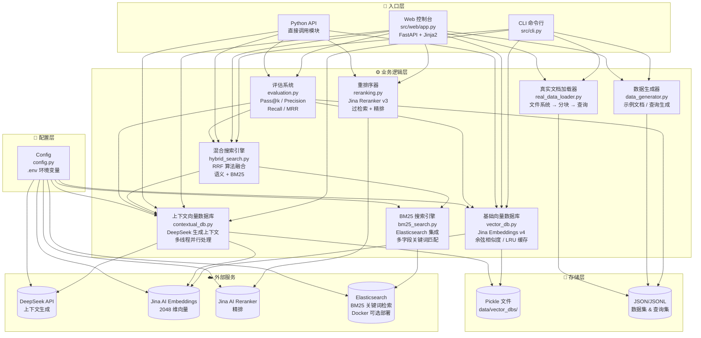
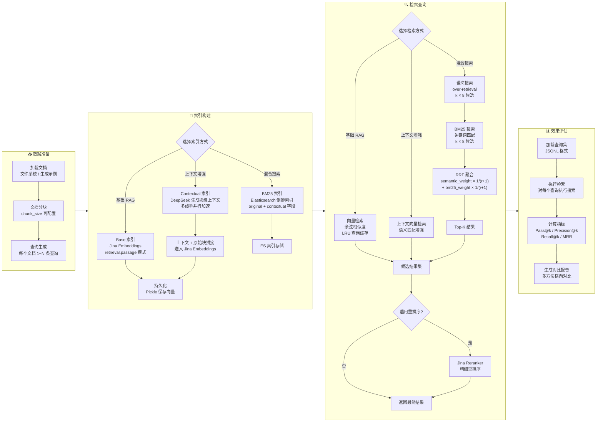

# 系统架构

> 本文档承接 README 的架构细节：模块依赖图、端到端流程、向量存储机制、演进路线与核心算法。技术定位与快速开始见 [README](../README.md)。

## 1. 系统结构图

模块间的静态依赖关系：



## 2. 端到端业务流程

从数据准备到效果评估的完整流程：



## 3. 向量存储机制

**本项目未使用传统专用向量数据库（如 Pinecone、Weaviate、Chroma、Milvus 等）。**

向量存储和检索完全自主实现于 `src/vector_db.py`，采用 **Pickle 序列化 + 全量内存暴力检索**方案：

| 组件 | 实现方式 |
|------|----------|
| **存储格式** | `data/vector_dbs/<name>/vector_db.pkl` |
| **向量数据** | `List[np.ndarray]` — numpy 2048 维浮点数组列表 |
| **元数据** | `List[Dict]` — 文档 ID、块 ID、原文、上下文 |
| **缓存** | LRU 字典（上限 1000 条），避免重复嵌入计算 |
| **检索算法** | 全量余弦相似度：`np.dot(embeddings, query_embedding)` → `np.argsort` |
| **数据持久化** | pickle.dump → pickle.load |

> 适用场景：**小规模 Demo / 学术评估**（~数千个块）。无 ANN 索引（HNSW/IVF）、无分片、无分布式能力。选择此方案因为项目核心目标是**对比不同检索策略的精度差异**（base vs contextual vs hybrid vs rerank），而非构建高性能生产级检索系统。

## 4. RAG 演进路线

```
基础 RAG          标准嵌入 + 余弦相似度
    ↓
上下文增强 RAG    块嵌入前注入 DeepSeek 全局语境
    ↓
混合搜索 RAG      语义 + BM25 关键词互补 (RRF 融合)
    ↓
重排序 RAG        过检索后 Jina Reranker 二次精排
```

每个阶段在精度和成本之间取不同权衡点：

| 阶段 | 精度提升 | 增量成本 | 推荐场景 |
|------|----------|----------|----------|
| 基础 RAG | 基准线 | 无 | 快速验证 |
| + 上下文增强 | +7–9% Pass@k | DeepSeek 一次性生成 | 低成本提精 |
| + 混合搜索 | +1–2% Pass@k | Elasticsearch 基础设施 | 平衡生产系统 |
| + 重排序 | +3–4% Pass@k | 每次查询 Jina 费用 | 最高精度需求 |

## 5. 核心算法与实现细节

### 5.1 上下文生成

使用 DeepSeek API（OpenAI 兼容协议），将整篇文档和当前块拼接后发送给模型，由模型生成简洁的块级上下文描述：

```python
response = self.llm_client.chat.completions.create(
    model=self.config.DEEPSEEK_MODEL,     # 默认 deepseek 系列
    max_tokens=1000,
    temperature=0.0,
    messages=[{"role": "user", "content": prompt}],
)
```

### 5.2 RRF 混合与过检索

混合搜索使用 RRF（Reciprocal Rank Fusion）算法，融合语义搜索（余弦相似度）和 BM25 关键词搜索的结果：

```python
score = semantic_weight * (1 / (rank_semantic + 1)) +
        bm25_weight * (1 / (rank_bm25 + 1))
```

默认权重 0.8:0.2，语义搜索主导、BM25 补充精确关键词匹配。同时使用**过检索策略**（检索 k×8 个候选），确保融合后的候选池覆盖足够全面的结果。

### 5.3 Jina 任务感知嵌入

Jina Embeddings 支持任务感知嵌入，系统自动区分：

- `retrieval.passage` — 文档/块嵌入（建库时）
- `retrieval.query` — 查询嵌入（搜索时）

这种非对称嵌入策略显著提升检索质量。

### 5.4 并行处理

上下文生成使用多线程并行处理，可配置线程数以平衡速度与 API 速率限制：

```python
with ThreadPoolExecutor(max_workers=parallel_threads) as executor:
    futures = [
        executor.submit(process_chunk, doc, chunk)
        for doc in dataset
        for chunk in doc["chunks"]
    ]

    for future in as_completed(futures):
        result = future.result()
```

---

变更记录：v1.0.0 / 2026-10-04 / 从 README 拆出架构细节（结构图、流程图、存储机制、算法），沿用原文内容
